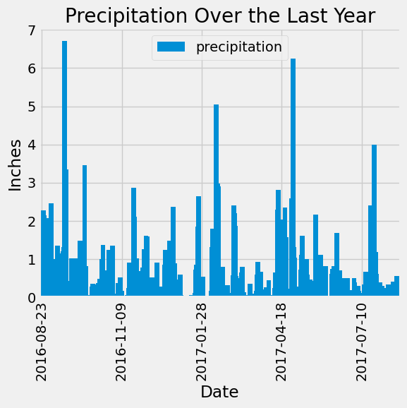
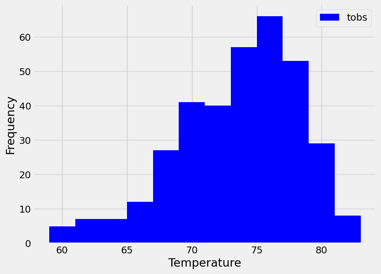

# SQLAlchemy Climate Analysis and API

## Overview
This project is designed to perform a climate analysis of Honolulu, Hawaii, using Python, SQLAlchemy, and Flask. It consists of two main parts:

1. **Climate Data Analysis** - Using SQLAlchemy to extract, analyze, and visualize precipitation and temperature data.
2. **Flask API Development** - Creating a Flask application to serve climate data via RESTful endpoints.

## Table of Contents
- [Overview](#overview)
- [Repository Structure](#repository-structure)
- [Part 1: Climate Data Analysis](#part-1-climate-data-analysis)
  - [Database Connection](#database-connection)
  - [Precipitation Analysis](#precipitation-analysis)
  - [Station Analysis](#station-analysis)
- [Part 2: Flask API Development](#part-2-flask-api-development)
  - [Available Routes](#available-routes)
    - [Homepage (`/`)](#1-homepage)
    - [Precipitation Data (`/api/v1.0/precipitation`)](#2-precipitation-data-apiv10precipitation)
    - [Station Data (`/api/v1.0/stations`)](#3-station-data-apiv10stations)
    - [Temperature Observations (`/api/v1.0/tobs`)](#4-temperature-observations-apiv10tobs)
    - [Temperature Summary (`/api/v1.0/<start>` and `/api/v1.0/<start>/<end>`)](#5-temperature-summary-apiv10start-and-apiv10startend)
- [Conclusion](#conclusion)

## Repository Structure
```
├── Resources/
│   ├── hawaii_measurements.csv
│   ├── hawaii_stations.csv
│   ├── hawaii.sqlite
├── app.py
├── climate_starter.ipynb
├── README.md
├── images/
│   ├── precipitation_plot.png
│   ├── temperature_histogram.png
```

## Part 1: Climate Data Analysis
The Jupyter Notebook (`climate_starter.ipynb`) contains the data analysis performed using SQLAlchemy and Pandas. The key steps include:

### Database Connection
- Connecting to the SQLite database (`hawaii.sqlite`) using `create_engine()`.
- Reflecting the database tables using `automap_base()`.
- Creating a session to interact with the database.

### Precipitation Analysis
- Finding the most recent date in the dataset.
- Querying precipitation data for the previous 12 months.
- Loading the query results into a Pandas DataFrame.
- Visualizing precipitation data using Matplotlib.



- Displaying summary statistics for precipitation.

### Station Analysis
- Counting the number of unique weather stations.
- Identifying the most active station (i.e., the one with the most observations).
- Querying the minimum, maximum, and average temperature at the most active station.
- Retrieving the last 12 months of temperature observations and visualizing them using a histogram.



## Part 2: Flask API Development
The `app.py` file sets up a Flask web application that provides access to the climate data:

### Available Routes
#### 1. Homepage (`/`)
Lists all available routes.

#### 2. Precipitation Data (`/api/v1.0/precipitation`)
- Returns JSON-formatted precipitation data for the last 12 months.

#### 3. Station Data (`/api/v1.0/stations`)
- Returns a JSON list of all available weather stations.

#### 4. Temperature Observations (`/api/v1.0/tobs`)
- Returns JSON-formatted temperature observations for the most active station over the past year.

#### 5. Temperature Summary (`/api/v1.0/<start>` and `/api/v1.0/<start>/<end>`)
- Returns the minimum, maximum, and average temperature for a given date range.
- If only a start date is provided, it calculates values from that date to the last available data point.
- If both start and end dates are provided using the URL format listed, it calculates values within that range.

## Conclusion
This project demonstrates how to analyze climate data using Python and SQLAlchemy and serve insights through a Flask API. The analysis helps understand temperature and precipitation trends in Honolulu, making it useful for planning travel or conducting further climate research.

